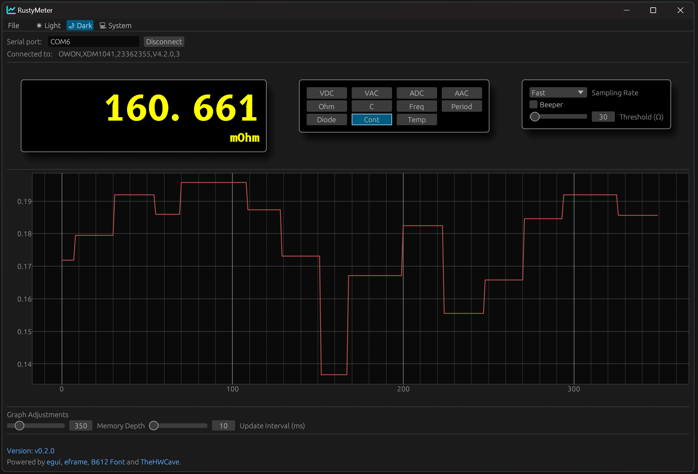
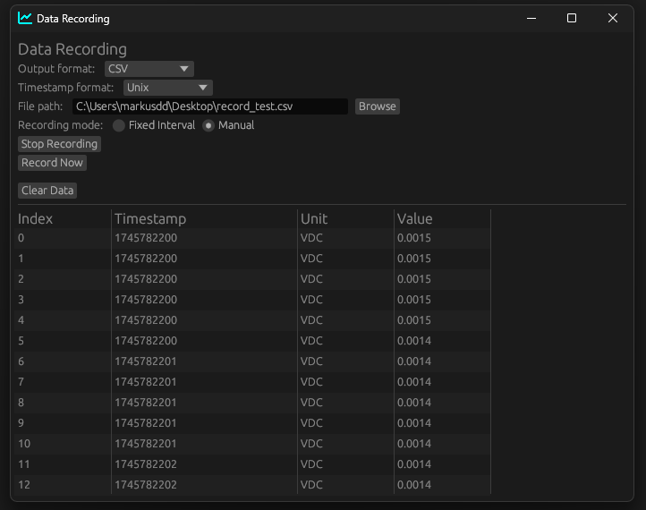

# RustyMeter

If you like this, a small donation is appreciated:

RustyMeter is a GUI application written in Rust powered by the awesome egui framework and builds
on the work of @TheHWCave to turn your OWON XDM multimeter into a PC-based powerhouse
with neat graphing, recording, using it on stream etc.

Meters which have been confirmed working already:

- XDM1041
- XDM1241
- XDM2041 (except 4W resistance, not yet implemented)

Looking for testers for the XDM3000 series!

Eventually, as this is all SCPI based, it could also be extended to other meters that have SCPI interfaces.
Maybe some stuff even works out of the box.

**NOTE:** This is work and progress and I have more features for this in mind. what works right now is connecting to the multimeter, switching modes and ranges as well as sampling rates. You also get nice graphing for a configureable amount of last samples and you can record samples to CSV, XLSX and JSON.

**TODO:**

- math modes
- code refactoring for easier integration of other meters
- make serial parameters changeable

## How to get going

You can clone this repository and just run `cargo build --release`, provided you have rust installed (use `rustup`, it's easy).
The Releases section has automatically built releases for Mac ARM64 and x86_64, Windows 11 x86_64 and Linux x86_64.

### IMPORTANT for Windows

For Windows, if you do not have it from another application, you might need to install the ch340 serial driver.
(Owon has it in their application installer package, it can also be found directly on the WCH manufacturer webpage)

The pre-built binaries might not run on Windows 10 if the installation is not up to date. In this case you might
need to compile from source.

### IMPORTANT for Mac/Linux

Mac and Linux ship the driver per default. On Linux, you might need to configure udev-rules or make sure you are
in the proper serial user group to access serial devices. (google for your distribution what the proper group is)

Mac might require you to explicitly trust the application/binary in the system settings after first launch.
Gatekeeper requires a signed binary and I have no way of obtaining this signature for such an open source project.

## What this is NOT

Technically, a multimeter is not an oscilloscope. So even though you get a nice time-graph of your measurements,
keep in mind the meter measures values much more accurately, but also wayyyyyyy slower compared to an oscilloscope, so the
bandwidth is very, VERY small.
So if you need to pick up any type of logic or analog signals that are not at least semi-static: Use a logic analyzer or proper scope.
