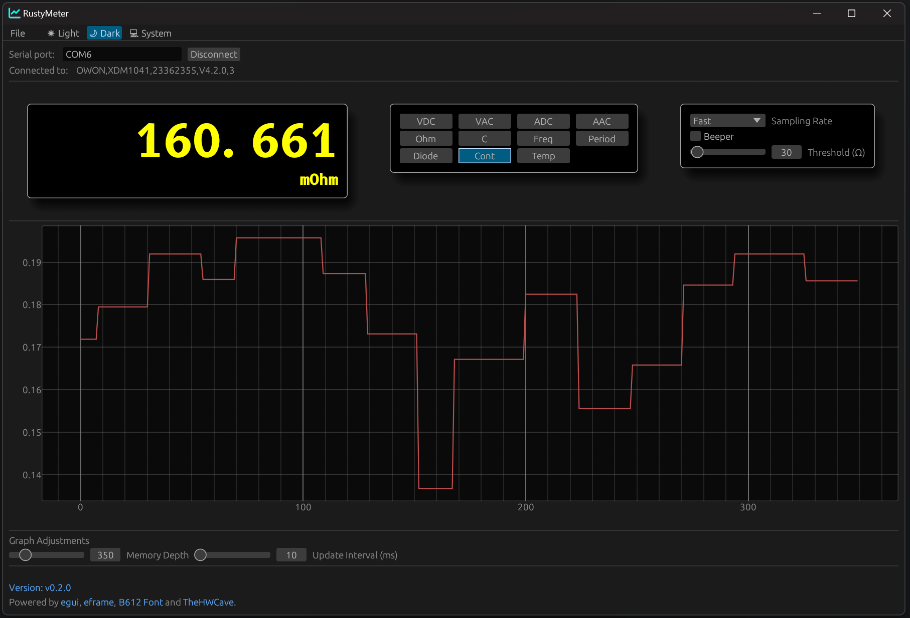
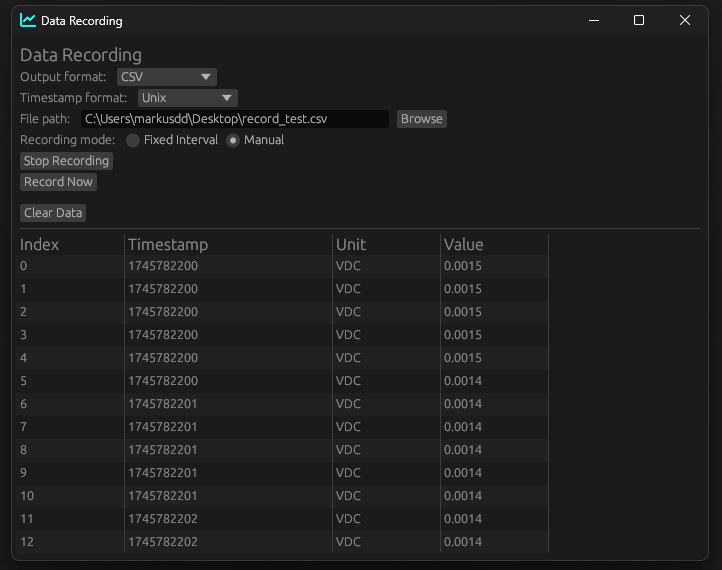
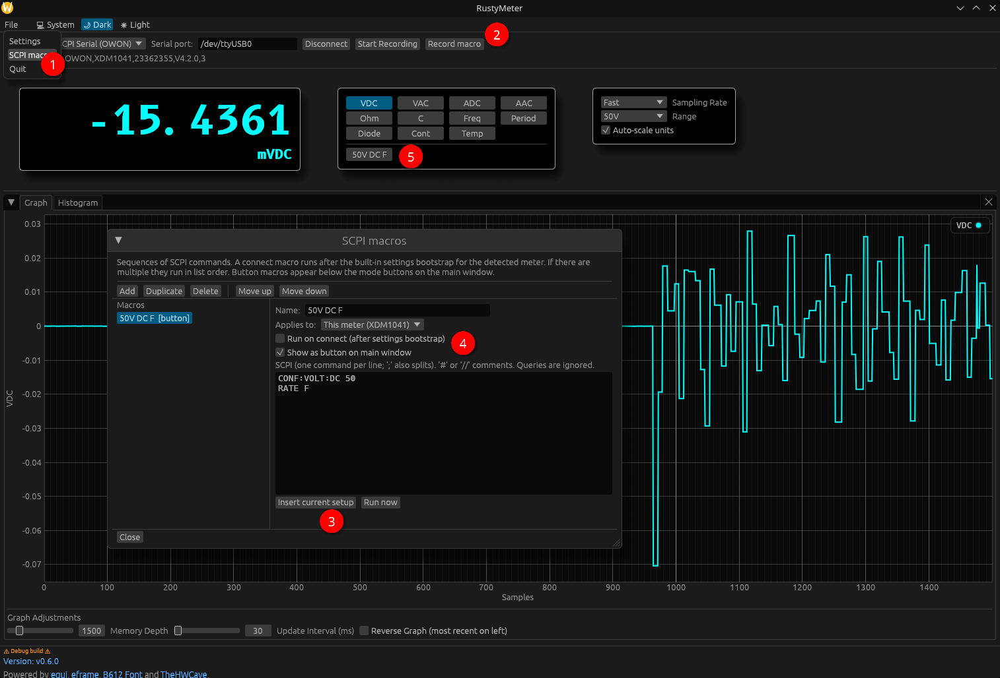

# RustyMeter

If you like this, a small donation is appreciated:

RustyMeter is a GUI application written in Rust powered by the awesome egui framework and builds
on the work of @TheHWCave to turn your OWON XDM or Victor multimeter into a PC-based powerhouse
with neat graphing, recording, using it on stream etc.

Meters which have been confirmed working already:

- Owon XDM1041
- Owon XDM1241
- Owon XDM2041 (except 4W resistance, not yet implemented)
- Victor 86 series

Looking for testers for the XDM3000 series!

## SCPI macros

On OWON SCPI meters you can store sequences of commands: play them on connect after the settings bootstrap, or click them as buttons under the mode grid. Victor read-only connections have no macros.

1. **File → SCPI macros** opens the editor. Add, duplicate, delete, and reorder entries. If several macros are set to run on connect, they run in list order.
2. **Record macro** (next to Start Recording) captures the SCPI you send from the UI (mode, range, rate, beeper, thresholds). Click again to stop; a new macro is created from that capture.
3. **Insert current setup** appends the live `CONF` / `RATE` (and beeper or threshold when relevant) into the body. **Run now** sends the selected macro to the meter immediately.
4. **Editor** — name; which meters it applies to (all SCPI, MEAS-era Owon, XDM 6000, this model, or an IDN substring); run on connect after bootstrap; show as a button on the main window; and the SCPI body. One command per line (`;` also splits). `#` or `//` start a comment. Queries (`…?`) are ignored.
5. **Main-window buttons** — macros marked “show as button” that match the connected meter appear under the mode grid. Short names take one cell; longer names snap to two cells. The row wraps after four columns.

Eventually, as this is all SCPI based (except the Victor driver), it could also be extended to other meters that have SCPI interfaces.
Maybe some stuff even works out of the box.

**NOTE:** This is work in progress and I have more features for this in mind. What works right now is connecting to the multimeter, switching modes and ranges as well as sampling rates, SCPI macros on Owon meters, graphing for a configurable amount of last samples, and recording samples to CSV, XLSX and JSON.

**TODO:**

- math modes
- code refactoring for easier integration of other meters
- make serial parameters changeable

## How to get going

You can clone this repository and just run `cargo build --release`, provided you have rust installed (use `rustup`, it's easy).
The Releases section has automatically built releases for Mac ARM64 and x86_64, Windows 11 x86_64 and Linux x86_64.

### IMPORTANT for Windows

For Windows, if you do not have it from another application, you might need to install the ch340 serial driver.
(Owon has it in their application installer package, it can also be found directly on the WCH manufacturer webpage)

The pre-built binaries might not run on Windows 10 if the installation is not up to date. In this case you might
need to compile from source.

### IMPORTANT for Mac/Linux

Mac and Linux ship the driver per default. On Linux, you might need to configure udev-rules or make sure you are
in the proper serial user group to access serial devices. (google for your distribution what the proper group is)

Mac might require you to explicitly trust the application/binary in the system settings after first launch.
Gatekeeper requires a signed binary and I have no way of obtaining this signature for such an open source project.

## What this is NOT

Technically, a multimeter is not an oscilloscope. So even though you get a nice time-graph of your measurements,
keep in mind the meter measures values much more accurately, but also wayyyyyyy slower compared to an oscilloscope, so the
bandwidth is very, VERY small.
So if you need to pick up any type of logic or analog signals that are not at least semi-static: Use a logic analyzer or proper scope.
