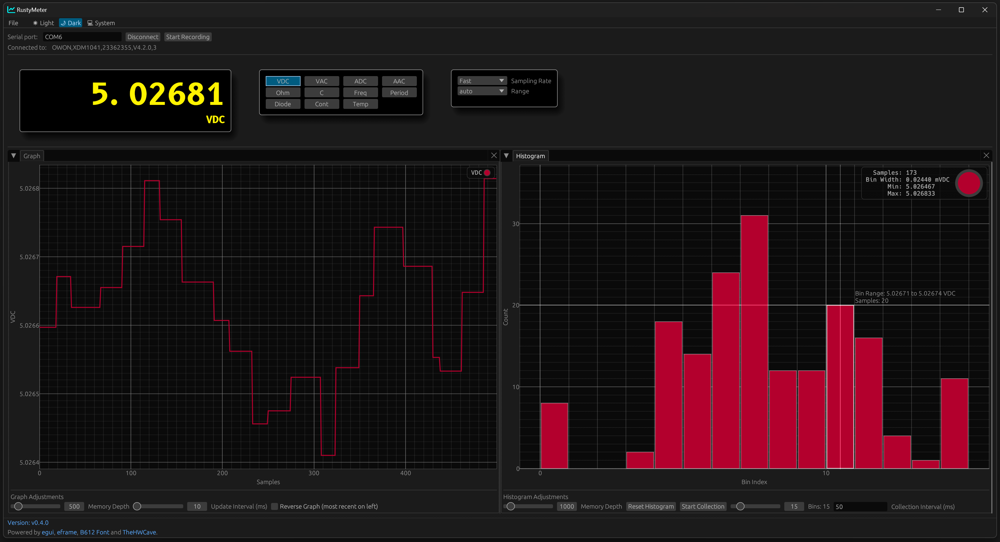

# RustyMeter

If you like this, a small donation is appreciated:

This is a GUI application written in Rust powered by the awesome egui framework and builds
on the work of @TheHWCave to turn your OWON XDM1041 multimeter into a PC-based powerhouse
with neat graphing, recording, using it on stream etc.

Eventually, as this is all SCPI based, it could also be extended to other meters that have SCPI interfaces.
Maybe some stuff even works out of the box.

**NOTE:** This is work and progress and I have more features for this in mind. what works right now is connecting to the multimeter, switching modes and ranges as well as sampling rates. You also get nice graphing for a configureable amount of last samples.

**TODO:**

- math modes
- code refactoring for easier integration of other meters
- make serial parameters changeable
- csv record export

## How to get going

You can clone this repository and just run `cargo build --release`, provided you have rust installed (use `rustup`, it's easy).
The Releases section has automatically built releases for Mac ARM64 and x86_64, Windows x86_64 and Linux x86_64.

## What this is NOT

Technically, a multimeter is not an oscilloscope. So even though you get a nice time-graph of your measurements, 
keep in mind the meter measures values much more accurately, but also wayyyyyyy slower compared to an oscilloscope, so the
bandwidth is very, VERY small.
So if you need to pick up any type of logic or analog signals that are not at least semi-static: Use a logic analyzer or proper scope.
